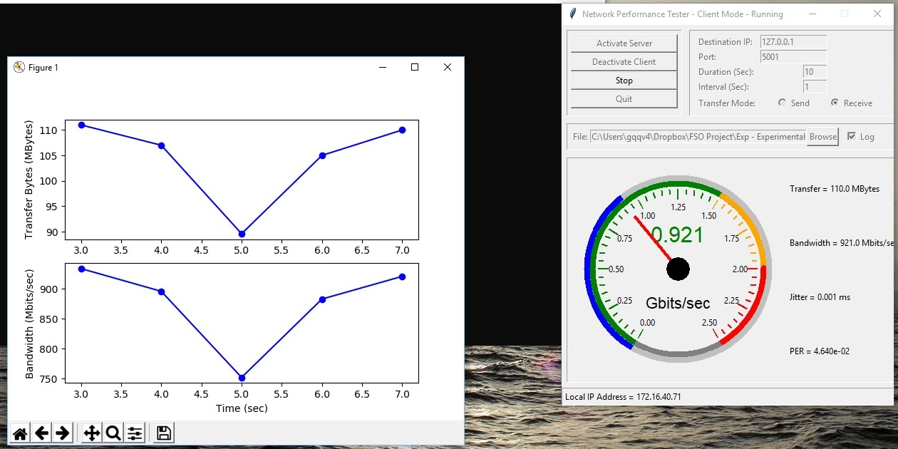

# NetPerfTester

Network Connection Performance Tester, a Python GUI for iperf

This Python script is compatible with Python 3.7. The module provides required GUI to analyze network performance using 'iperf version 2' for 'Linux' and 'iperf version 3' for 'Windows'. The measurement parameters are 'Transfer Bytes', 'Bandwidth', 'Jitter', and 'Packet Error Rate (PER)'. The GUI also provides 'Log' feature for saving the measurement into a CSV format file.

The bandwidth gauge widget is from:
https://github.com/NickWaterton/iperf3-GUI

I was planning to use 'iperf3' for both 'Windows' and 'Linux', while using provided stdout pipe line to capture the generated outputs. However neither of 'iperf2' and 'iperf3' are flushing the stdout pipe lines right after. So for both case scenarios I used a standard OS-dependent method to save the generated text into a file. Then by opening the file and analysing it the GUI produces the outputs.

By trial and error I found out that iperf2 is the best option in 'ubntu  18.04' where as 'iperf3' is working fine in 'windows 10'.

Download iperf3 and copy and past all the files into folder 'bin'.
 
The folder already contains two script files. The script files are used to terminate the process using a specific port in both 'Windows' and 'Linux'. For some reason the code is not able to terminate the 'iperf' subprocess while running in 'Linux'.
To terminate the process using a specific port, in the command line type:
> bash  ./KillPortProcessLinux.sh PORT

The following packages are needed to run the code:
time, os, tkinter, socket, re, threading, platform, tempfile, subprocess, numpy, matplotlib, collections, math

To run the code, use the following syntax:

> python NetPerfTester.py

Please let me know if you think of anyway to improve the code.
